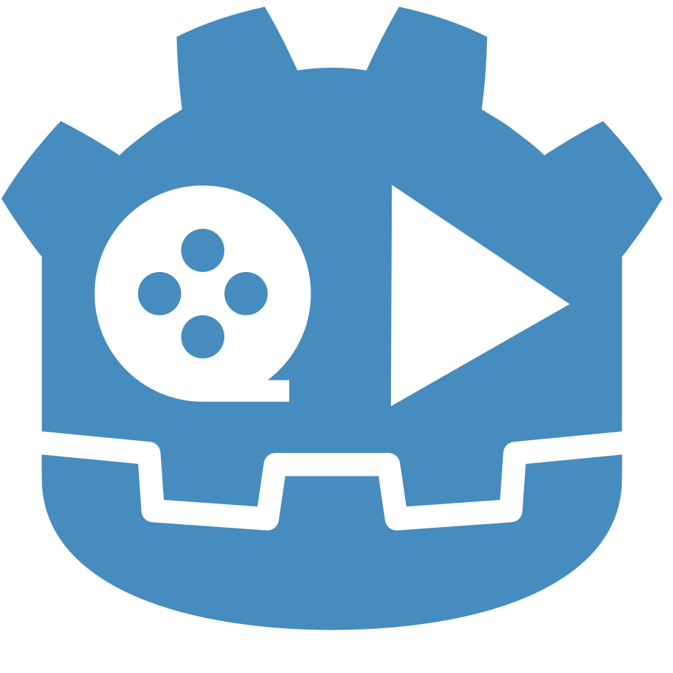

<div align="center">

  
  
  <h1>Godot Video Converter</h1>
  
  <p>
      Video converting made easy. 
  </p>
  
  
<!-- Badges -->
<p>
    <a href="https://github.com/RubenCamus/godot-video-converter/graphs/contributors">
        
    </a>
    <a href="https://github.com/RubenCamus/godot-video-converter/network/members">
        
    </a>
    <a href="https://github.com/RubenCamus/godot-video-converter/stargazer">
      
    </a>
    <a href="https://github.com/RubenCamus/godot-video-converter/issues">
        
    </a>
    <a href="https://github.com/RubenCamus/godot-video-converter/network/blob/master/LICENSE">
        
    </a>
<h4>
    <a href="https://github.com/RubenCamus/godot-video-converter/">View Demo</a>
  <span> · </span>
    <a href="https://github.com/RubenCamus/godot-video-converter/issues/">Report Bug</a>
  <span> · </span>
    <a href="https://github.com/RubenCamus/godot-video-converter/issues/">Request Feature</a>
</h4>
</div>

<br />

<!-- Table of Contents -->
# Table of Contents

- [About the Project](#about-the-project)
  * [Screenshots](#screenshots)
  * [Tech Stack](#tech-stack)
  * [Features](#features)
  * [Color Reference](#color-reference)
- [Getting Started](#getting-started)
  * [Prerequisites](#prerequisites)
  * [Installation](#installation)
  * [Run Locally](#run-locally)
  * [Deployment](#deployment)
- [Usage](#usage)
- [Roadmap](#roadmap)
- [Contributing](#contributing)
  * [Code of Conduct](#code-of-conduct)
- [FAQ](#faq)
- [License](#license)
- [Contact](#contact)
- [Acknowledgements](#acknowledgements)

  

<!-- About the Project -->
## About the Project
This project's goal is to make converting video files for your projects easier. It started with issues converting to OGV Theora, which is the only accepted format for [VideoStreamPlayer](https://docs.godotengine.org/en/stable/tutorials/animation/playing_videos.html). The docs help converting to ogv, but it is not very intuitive, and this app makes the process easier + letting convert you to other video formats as *gif mov mkv mp4*.

I am working to add more features and improve the current ones, I would love to hear feedback and collaborate.

<!-- Screenshots -->
### Screenshots

<div align="center"> 
  
</div>


<!-- TechStack -->
### Tech Stack

<details>
  <summary>Client</summary>
  <ul>
    <li><a href="https://www.typescriptlang.org/">Typescript</a></li>
    <li><a href="https://electronjs.org">Electron.js</a></li>
    <li><a href="https://reactjs.org/">React.js</a></li>
  </ul>
</details>

<details>
  <summary>Server</summary>
  <ul>
    <li><a href="https://www.python.org/">Python</a></li>
    <li><a href="https://fastapi.tiangolo.com/">FastAPI</a></li>
    <li><a href="https://www.ffmpeg.org/"> ffmpeg </a></li>
  </ul>
</details>
<!-- Features -->

### Features

- Convert video format.

<!-- Color Reference -->
### Color Reference

| Color             | Hex                                                                |
| ----------------- | ------------------------------------------------------------------ |
| Primary Color |  #53A5E0 |
| Secondary Color |  #348D87 |
| Accent Color |  #62C9FF |
| Text Color |  #FCFCFC |

## Getting Started
<!-- Prerequisites -->
### Prerequisites
Recommended Versions:

Node.js: 25.7.0  or later

Python: 3.14.5 or later

ffmpeg 8.1.1 or later

The project currently requires Python and FFmpeg installed and in PATH to run the local backend.
<!-- Installation -->
### Installation

#### Download

Download the latest release for your OS from [Releases](github.com/RubenCamus/godot-video-converter/releases)
   
<!-- Run Locally -->
### Run from source

Clone the project

```bash
  git clone https://github.com/RubenCamus/godot-video-converter.git
  cd godot-video-converter
```
Install dependencies

```bash
  npm install
```

#### Set up the Python backend
Python must be installed and available in PATH

To verify open your OS terminal and try: python -v

Create a virtual environment

```bash
  python -m venv backend/.venv
```

Activate it

```bash
  .\backend\.venv\Scripts\activate
```

Install the backend dependencies

```bash
pip install -r requirements.txt
```
#### Install FFmpeg
FFmpeg must be installed and available in PATH

To verify open your OS terminal and try: ffmpeg -version

Start the server (Electron+Vite+FastAPI)

```bash
  npm run start
```

<!-- Deployment -->
### Deployment

To build this project run

```bash
  npm run make
```


<!-- Usage -->
## Usage

FastAPI is located at backend -> main.py | ffmpeg processing is located in godot_video_converter.py
```python
app = FastAPI()
app.add_middleware(
    CORSMiddleware,
    allow_origins=origins,
    allow_headers=["*"],
    allow_methods=["*"]
)
```

Most of Frontend logic, fetches are in FrontendService.ts file.

Useful app configuration can be found in config.ts. Here you can change the URL, Port, maximum file size for videos.
<!-- Roadmap -->
## Roadmap

* [x] First release
* [ ] Release for MacOS and Linux. Choose video & audio quality.
* [ ] Improve UI, change config inside APP, refactor code.
* [ ] Audio conversion.
* [ ] Extract frames, and convert video/images to spritesheet.

<!-- Contributing -->
## Contributing

<a href="https://github.com/RubenCamus/godot-video-converter/graphs/contributors">
  
</a>


Contributions are always welcome!

See `contributing.md` for ways to get started.


<!-- Code of Conduct -->
### Code of Conduct

Please read the [Code of Conduct](https://github.com/RubenCamus/godot-video-converter/blob/master/CODE_OF_CONDUCT.md)

<!-- FAQ -->
## FAQ

-  Can I contribute to this project?

    + Yes, you are more than welcome to add/request features, fix bugs... all help is welcome.

- Can I fork or redistribute this project?

    + You can do everything under the MIT License, use, modify, sell, distribute.


<!-- License -->
## License

Distributed under the MIT License. See LICENSE.txt for more information.


<!-- Contact -->
## Contact

Ruben Camus - Discord: riisenx - rubencamus@hotmail.com

Project Link: [https://github.com/RubenCamus/godot-video-converter](https://github.com/RubenCamus/godot-video-converter)


<!-- Acknowledgments -->
## Acknowledgements

Useful resources and libraries that I have used.

 - [Shields.io](https://shields.io/)
 - [Awesome README](https://github.com/Louis3793/awesome-readme-template)
 - [Emoji Cheat Sheet](https://github.com/ikatyang/emoji-cheat-sheet/blob/master/README.md#travel--places)
