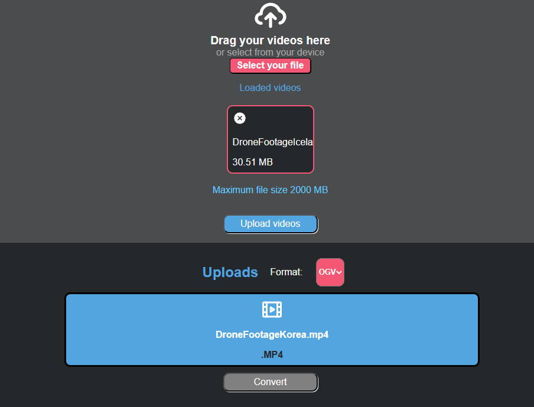

<div align="center">

  
  <h1>Godot Video Converter</h1>
  
  <p>
      Video converting made easy. 
  </p>
  
  
<!-- Badges -->
<p>
    <a href="https://github.com/RubenCamus/godot-video-converter/graphs/contributors">
        
    </a>
    <a href="https://github.com/RubenCamus/godot-video-converter/network/members">
        
    </a>
    <a href="https://github.com/RubenCamus/godot-video-converter/stargazer">
      
    </a>
    <a href="https://github.com/RubenCamus/godot-video-converter/issues">
        
    </a>
    <a href="https://github.com/RubenCamus/godot-video-converter/network/blob/master/LICENSE">
        
    </a>
<h4>
    <a href="https://github.com/Louis3797/awesome-readme-template/">View Demo</a>
  <span> · </span>
    <a href="https://github.com/Louis3797/awesome-readme-template/issues/">Report Bug</a>
  <span> · </span>
    <a href="https://github.com/Louis3797/awesome-readme-template/issues/">Request Feature</a>
</h4>
</div>

<br />

<!-- Table of Contents -->
# :notebook_with_decorative_cover: Table of Contents

- [About the Project](#star2-about-the-project)
  * [Screenshots](#camera-screenshots)
  * [Tech Stack](#space_invader-tech-stack)
  * [Features](#dart-features)
  * [Color Reference](#art-color-reference)
  * [Environment Variables](#key-environment-variables)
- [Getting Started](#toolbox-getting-started)
  * [Prerequisites](#bangbang-prerequisites)
  * [Installation](#gear-installation)
  * [Running Tests](#test_tube-running-tests)
  * [Run Locally](#running-run-locally)
  * [Deployment](#triangular_flag_on_post-deployment)
- [Usage](#eyes-usage)
- [Roadmap](#compass-roadmap)
- [Contributing](#wave-contributing)
  * [Code of Conduct](#scroll-code-of-conduct)
- [FAQ](#grey_question-faq)
- [License](#warning-license)
- [Contact](#handshake-contact)
- [Acknowledgements](#gem-acknowledgements)

  

<!-- About the Project -->
## :star2: About the Project
This project's goal is to make converting video files for your projects easier. It started with issues converting to OGV Theora, which is the only accepted format for [VideoStreamPlayer](https://docs.godotengine.org/en/stable/tutorials/animation/playing_videos.html). The docs help converting to ogv, but it is not very intuitive, and this app makes the process easier + letting convert you to other video formats as *gif mov mkv mp4*.

I am working to add more features and improve the current ones, I would love to hear feedback and collaborate.

<!-- Screenshots -->
### :camera: Screenshots

<div align="center"> 
  
</div>


<!-- TechStack -->
### :space_invader: Tech Stack

<details>
  <summary>Client</summary>
  <ul>
    <li><a href="https://www.typescriptlang.org/">Typescript</a></li>
    <li><a href="https://electronjs.org">Electron.js</a></li>
    <li><a href="https://reactjs.org/">React.js</a></li>
  </ul>
</details>

<details>
  <summary>Server</summary>
  <ul>
    <li><a href="https://www.python.org/">Python</a></li>
    <li><a href="https://fastapi.tiangolo.com/">FastAPI</a></li>
    <li><a href="https://www.ffmpeg.org/"> ffmpeg </a></li>
  </ul>
</details>
<!-- Features -->
### :dart: Features

- Convert video format.

<!-- Color Reference -->
### :art: Color Reference

| Color             | Hex                                                                |
| ----------------- | ------------------------------------------------------------------ |
| Primary Color |  #53A5E0 |
| Secondary Color |  #348D87 |
| Accent Color |  #62C9FF |
| Text Color |  #FCFCFC |

<!-- Prerequisites -->
### :bangbang: Prerequisites
Node.js: 25.7.0  or later

Python: 3.14.5 or later

ffmpeg 8.1.1 or later

<!-- Installation -->
### :gear: Installation

#### Download

Download the latest release for your OS from [Releases](github.com/RubenCamus/godot-video-converter/releases)
   
<!-- Run Locally -->
### :running: Run Locally

Clone the project

```bash
  git clone https://github.com/RubenCamus/godot-video-converter.git
```

Go to the project directory

```bash
  cd godot-toolkit 
```

Install dependencies

```bash
  npm install
```

Start the server (Electron+Vite+FastAPI)

```bash
  npm run start
```


<!-- Build -->
### :triangular_flag_on_post: Build

To build this project run

```bash
  npm run package
```


<!-- Usage -->
## :eyes: Usage

Use this space to tell a little more about your project and how it can be used. Show additional screenshots, code samples, demos or link to other resources.

FastAPI is located at backend -> main.py | ffmpeg processing is located in godot_video_converter.py
```python
app = FastAPI()
app.add_middleware(
    CORSMiddleware,
    allow_origins=origins,
    allow_headers=["*"],
    allow_methods=["*"]
)
```

Most of Frontend logic, fetches
<!-- Roadmap -->
## :compass: Roadmap

* [x] Todo 1
* [ ] Todo 2


<!-- Contributing -->
## :wave: Contributing

<a href="https://github.com/Louis3797/awesome-readme-template/graphs/contributors">
  
</a>


Contributions are always welcome!

See `contributing.md` for ways to get started.


<!-- Code of Conduct -->
### :scroll: Code of Conduct

Please read the [Code of Conduct](https://github.com/Louis3797/awesome-readme-template/blob/master/CODE_OF_CONDUCT.md)

<!-- FAQ -->
## :grey_question: FAQ

- Question 1

  + Answer 1

- Question 2

  + Answer 2


<!-- License -->
## :warning: License

Distributed under the no License. See LICENSE.txt for more information.


<!-- Contact -->
## :handshake: Contact

Your Name - [@twitter_handle](https://twitter.com/twitter_handle) - email@email_client.com

Project Link: [https://github.com/Louis3797/awesome-readme-template](https://github.com/Louis3797/awesome-readme-template)


<!-- Acknowledgments -->
## :gem: Acknowledgements

Use this section to mention useful resources and libraries that you have used in your projects.

 - [Shields.io](https://shields.io/)
 - [Awesome README](https://github.com/matiassingers/awesome-readme)
 - [Emoji Cheat Sheet](https://github.com/ikatyang/emoji-cheat-sheet/blob/master/README.md#travel--places)
 - [Readme Template](https://github.com/othneildrew/Best-README-Template)
